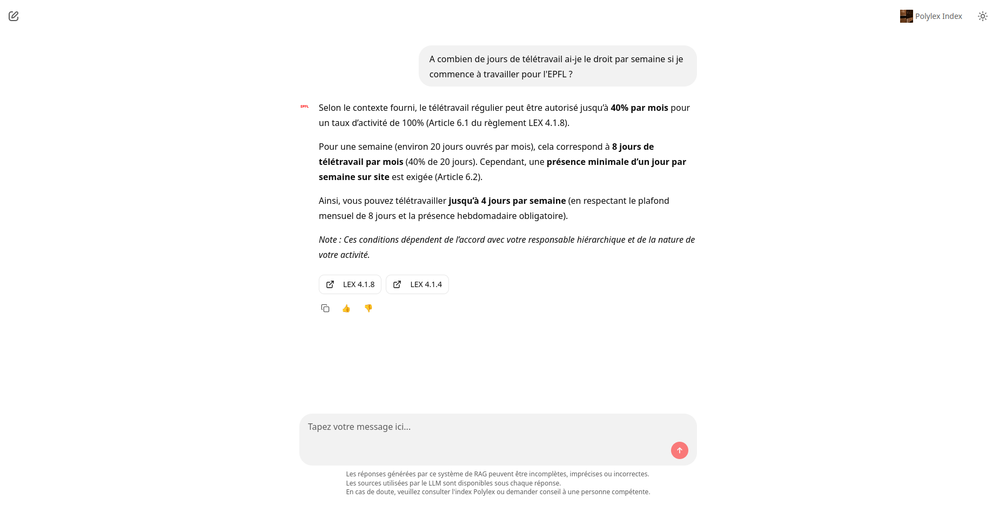

#  Système interactif pour l'accès aux documents légaux de l'EPFL

Ce projet fournit un système de recherche conversationnelle basé sur un RAG permettant d’interroger les documents légaux de l’EPFL référencés dans [Polylex](https://polylex.epfl.ch) :



Plusieurs expérimentations ont été réalisées afin d’identifier les hyperparamètres permettant d’obtenir les meilleures performances avec le système RAG.
Les résultats sont disponibles dans le dossier [evaluations](evaluations) et la documentation associée dans le fichier [evaluations_doc.md](documentation/evaluations_doc.md) (méthodologie et analyse).

## Prérequis

Pour développer en local et déployer l’application sur des machines virtuelles, il est nécessaire d’avoir :
- un accès à l’équipe *epfl_wppolylex* dans Keybase afin de récupérer les secrets ;
- [Docker](https://docs.docker.com/engine/install/), [Python](https://www.python.org/downloads/) et [Ansible](https://docs.ansible.com/projects/ansible/latest/installation_guide/intro_installation.html) installés sur sa machine.

## Stack technique

Le projet utilise principalement les technologies suivantes :
- Python pour le développement applicatif ;
- [Qdrant](https://github.com/qdrant/qdrant) comme base de données vectorielle ;
- [Langfuse](https://github.com/langfuse/langfuse) pour le monitoring et le tracing ;
- [Chainlit](https://github.com/chainlit/chainlit) pour l’interface du chatbot ;
- Ansible pour le déploiement sur les VMs.

## Développement local

### 1. Configuration de l’environnement

1. Créer un environnement virtuel avec **Python 3.12**, puis y installer les dépendances définies dans le fichier [`requirements.txt`](requirements.txt).
2. Exécuter `playwright install` pour finaliser l'installation de [Playwright](https://playwright.dev/) (nécessaire pour construire le corpus). 
3. Créer un fichier `.env` à partir du fichier d’exemple fourni et compléter ensuite les variables d’environnement nécessaires.
Il est également possible de copier le fichier `.env.dev` disponible sur Keybase contenant la configuration du système de RAG final.

### 2. Démarrer la base de données vectorielle

Se placer dans le dossier [database](database) puis démarrer Qdrant avec Docker Compose ([documentation officielle](https://qdrant.tech/documentation/guides/installation/)) :

```shell
cd database
docker compose up -d
```

Une documentation contenant quelques exemples de requête est disponible dans [qdrant_doc.md](documentation/qdrant_doc.md).

### 3. Mettre en place la plateforme de tracing

Les explications ci-dessous se basent sur la [documentation officielle](https://langfuse.com/self-hosting/deployment/docker-compose).

1. Cloner le [repository Langfuse](https://github.com/langfuse/langfuse) dans le dossier [monitoring](monitoring).
2. Se déplacer dans le dossier [`langfuse`](monitoring/langfuse) venant d'être créé.
3. Démarrer le service avec `docker compose up -d`.

Aller sur l'interface web, configurer un projet puis créer une nouvelle API key.
Les valeurs générées doivent être copiées dans le fichier d'environnement (variables *LANGFUSE_SECRET_KEY* et *LANGFUSE_PUBLIC_KEY*).

### 4. Exécuter le pipeline de construction, d’indexation et d’évaluation

Le projet contient plusieurs scripts permettant de construire le corpus ainsi que les métadonnées associées, de créer une collection dans la base de données vectorielle et d'évaluer le système RAG sur la base d'un jeu de questions.

Les explications détaillées concernant le lancement de ces scripts se trouvent dans le fichier [playbook.md](documentation/playbook.md).

#### Description des scripts

##### 1. `build_corpus.py`

Ce script télécharge l'ensemble des documents (pdf, docx et txt) et crée un fichier de métadonnées associé.

##### 2. `compute_stats.py`

Ce script calcule des statistiques sur les métadonnées du corpus construit ainsi que sur son contenu textuel.

##### 3. `index_corpus.py`

Ce script segmente les documents, les vectorise et les indexe.

##### 4. `create_langfuse_directory.py`

Ce script crée deux jeux de données (dev et test) dans Langfuse basé sur [questions_dataset.csv](questions_dataset.csv).

##### 5. `trigger_run.py`

Ce script évalue le système de RAG via Langfuse sur le jeu de questions spécifié. L'évaluation s'appuie sur différentes métriques, telles que *recall@k* pour la partie *retrieval* et *semantic_similarity* ou *groundedness* pour la partie *generation*.

##### 6. `analyze_run.py`

Ce script récupère les résultats d’évaluation depuis Langfuse, puis génère des synthèses statistiques et des visualisations permettant d’analyser les performances du système RAG. Les résultats produits sont sauvegardés dans le dossier [evaluations](evaluations).

### 5. Démarrer le chatbot

```shell
(cd app && PYTHONPATH="../src" chainlit run app.py -w)
```

## Déploiement sur des machines virtuelles

Le déploiement est réalisé avec Ansible depuis le dossier [ops](ops).

### Déployer sur les environnements de test et de prod

```shell
ansible-playbook -i ops/inventory.yml ops/playbook.yml
```

### Déployer sur un seul environnement

```shell
ansible-playbook -i ops/inventory.yml ops/playbook.yml --limit <vm>
```

### Mettre à jour le corpus

```shell
ansible-playbook -i ops/inventory.yml ops/playbook.yml --tags new_corpus
```

### Déployer une nouvelle version du système

```shell
ansible-playbook -i ops/inventory.yml ops/playbook.yml --tags new_release
```

## Accès aux services

| Environment | Chatbot                               | Langfuse                              | Qdrant                                          |
|-------------|---------------------------------------|---------------------------------------|-------------------------------------------------|
| Local       | http://localhost:8000                 | http://localhost:3000                 | http://localhost:6333/dashboard                 |
| Test        | https://polylex-chatbot-test.epfl.ch/ | http://itswbhst0031.xaas.epfl.ch:3000 | http://itswbhst0031.xaas.epfl.ch:6333/dashboard |
| Prod        | https://polylex-chatbot.epfl.ch/      | http://itswbhst0030.xaas.epfl.ch:3000 | http://itswbhst0030.xaas.epfl.ch:6333/dashboard |


## Structure du projet

```text
.
├── analysis
│   ├── chunkings_comparison
│   │   ├── chunking_strategies.ipynb
│   │   └── comparison_results
│   │       └── ...
│   ├── loaders_comparison
│   │   ├── comparison_results
│   │   │   ├── DoclingLoader_results
│   │   │   │   └── ...
│   │   │   ├── PDFPlumberLoader_results
│   │   │   │   └── ...
│   │   │   ├── PyMuPDFLoader_results
│   │   │   │   └── ...
│   │   │   ├── Tika_results
│   │   │   │   └── ...
│   │   │   └── UnstructuredPDFLoader_results
│   │   │       └── ...
│   │   └── loaders_comparison.ipynb
│   └── ttest.ipynb
├── app
│   ├── app.py
│   ├── chainlit.md
│   └── public
│       ├── default_theme.json
│       ├── elements
│       │   └── SourceReferences.jsx
│       ├── favicon.png
│       └── theme.json
├── database
│   ├── docker-compose.yml
│   └── qdrant_data
│       └── ...
├── documentation
│   └── ...
├── documents
│   ├── <corpus_name>
│   │   └── ...
│   └── ...
├── envs
├── evaluations
│   ├── <corpus_name>
│   │   ├── <collection_name>
│   │   │   ├── <configuration_name>
│   │   │   │   ├── confidence_intervals.png
│   │   │   │   ├── df_scores_ordered.csv
│   │   │   │   ├── df_stats.csv
│   │   │   │   ├── kendall_matrix_ground_truth_vs_generated.csv
│   │   │   │   ├── kendall_matrix_retrieval.csv
│   │   │   │   ├── kendall_matrix_triad.csv
│   │   │   │   ├── mean_recall_at_k.png
│   │   │   │   └── metric_boxplots.png
│   │   │   └── ...
│   │   └── ...
│   └── ...
├── LICENSE
├── monitoring
│   └── langfuse
│       └── ...
├── ops
│   ├── inventory.yml
│   ├── playbook.yml
│   ├── tasks
│   │   ├── db.yml
│   │   ├── main.yml
│   │   ├── monitoring.yml
│   │   ├── rag.yml
│   │   └── vm.yml
│   ├── templates
│   │   └── docker-compose.yml
│   └── vars
│       └── main.yml
├── private_questions_dataset.csv
├── questions_dataset.csv
├── README.md
├── requirements.txt
├── scripts
│   ├── analyze_run.py
│   ├── build_corpus.py
│   ├── compute_stats.py
│   ├── create_langfuse_datasets.py
│   ├── index_corpus.py
│   └── trigger_run.py
├── src
│   └── polylex_chatbot
│       ├── chunking.py
│       ├── config.py
│       ├── constants.py
│       ├── downloads.py
│       ├── env.py
│       ├── evaluators.py
│       ├── fedlex.py
│       ├── generation.py
│       ├── html_utils.py
│       ├── indexing.py
│       ├── __init__.py
│       ├── llm_context_utils.py
│       ├── metadata.py
│       ├── retrieval.py
│       ├── stats.py
│       └── tasks.py
├── stats
│   ├── <corpus_name>
│   │   ├── <collection_name>
│   │   │   ├── chunks.txt
│   │   │   └── plot_chunks_distribution.png
│   │   ├── ...
│   │   │   └── ...
│   │   ├── corpus_metadata.json
│   │   ├── plot_nb_occ_article.png
│   │   ├── stats_content_lengths.csv
│   │   ├── stats_corpus_content.csv
│   │   └── stats_corpus_metadata.json
│   └── ...
└── textual_contents
    ├── <corpus_name>
    │   └── ...
    └── ...
```

## Remarques et améliorations

Pour signaler un problème, proposer une amélioration ou documenter une évolution souhaitée, merci d'ouvrir une *issue* dans ce projet.

## Licence

[LICENSE](LICENSE)
