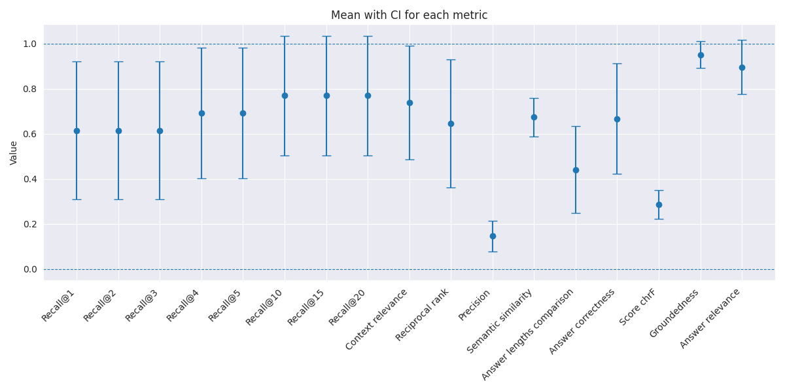
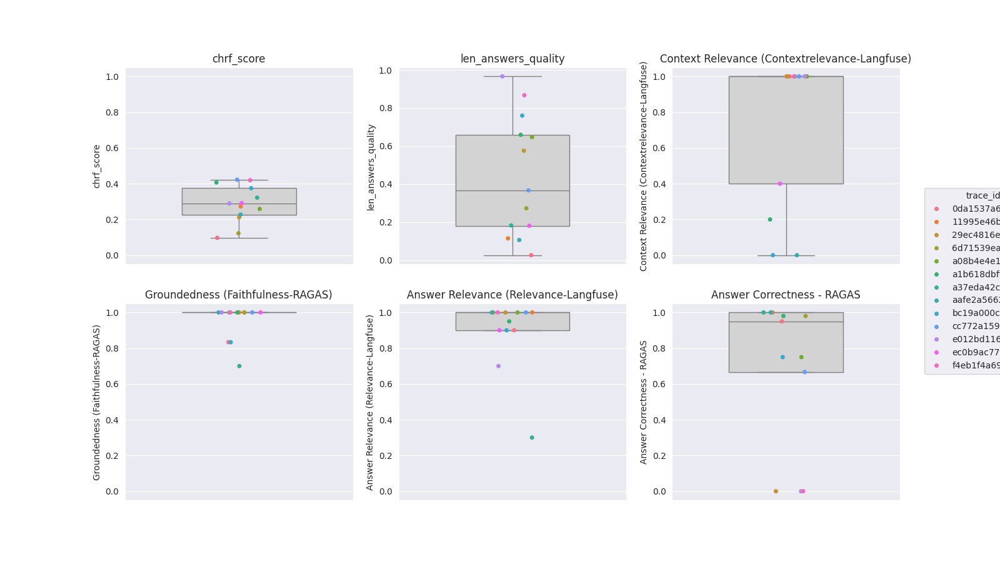

# Analyse des résultats du système utilisant la collection *20260616_164451_collection* et le llm *mistralai/Mistral-Small-3.2-24B-Instruct*

## Analyse ciblée sur les réponses générées

Une première analyse a été faite le 19 juin 2026 en prenant uniquement en considération :
- la question
- la réponse souhaitée ainsi que la réponse générée
- les connaissances personnelles sur chaque sujet
- le contexte fourni au LLM (pour certains cas plus complexes).

| Question                                                                                                                                                                                                                            | Réponse (vérité)                                                                                                                                                                                                                                                                                                                                                                                                                                                                                                                                                                                                             | Réponse (génération)                                                                                                                                                                                                                                                                                                                                                                                                                                                                                                                                                                                                                                                                                      | Analyse critique                                                                                                                                                                                                                                                                                  |
|-------------------------------------------------------------------------------------------------------------------------------------------------------------------------------------------------------------------------------------|------------------------------------------------------------------------------------------------------------------------------------------------------------------------------------------------------------------------------------------------------------------------------------------------------------------------------------------------------------------------------------------------------------------------------------------------------------------------------------------------------------------------------------------------------------------------------------------------------------------------------|-----------------------------------------------------------------------------------------------------------------------------------------------------------------------------------------------------------------------------------------------------------------------------------------------------------------------------------------------------------------------------------------------------------------------------------------------------------------------------------------------------------------------------------------------------------------------------------------------------------------------------------------------------------------------------------------------------------|---------------------------------------------------------------------------------------------------------------------------------------------------------------------------------------------------------------------------------------------------------------------------------------------------|
| A combien de semaines de vacances par an ai-je le droit à partir de 60 ans en tant qu'employé à l'EPFL ?                                                                                                                            | 6 semaines                                                                                                                                                                                                                                                                                                                                                                                                                                                                                                                                                                                                                   | Le contexte ne mentionne pas explicitement le droit aux vacances pour les employés de 60 ans. Cependant, il indique que les employés ont droit à 5 semaines de vacances par an, avec une augmentation à 6 semaines à partir de 50 ans. Il n'y a pas de mention d'une augmentation supplémentaire après 60 ans. Par conséquent, vous avez droit à 6 semaines de vacances par an à partir de 60 ans.                                                                                                                                                                                                                                                                                                        | La réponse ne contient que des éléments pertinents et corrects.                                                                                                                                                                                                                                   |
| Les emprunts dans un travail écrit doivent-ils être reconnaissable via une note en bas de page ?                                                                                                                                    | Non, uniquement reconnaissables                                                                                                                                                                                                                                                                                                                                                                                                                                                                                                                                                                                              | Non, les emprunts doivent être reconnaissables par une référence à la source, mais pas nécessairement via une note en bas de page. La référence peut être faite avant ou juste après la citation, voire par un renvoi (selon les articles 4.2 et 14.2 des directives).                                                                                                                                                                                                                                                                                                                                                                                                                                    | La réponse générée est correcte, mais il serait mieux de mentionner le numéro de LEX ainsi que le numéro d'article, et non que le numéro d'article.                                                                                                                                               |
| Quelles sont les conditions de réussite pour un bloc au niveau master à l'EPFL ?                                                                                                                                                    | Un bloc est réussi à partir du moment où toutes les matières du bloc ont été présentées et si la moyenne du bloc est de 4,00 ou plus. Le calcul de la moyenne tient compte des coefficients. A noter qu'il ne faut pas avoir de N/A car cela empêche de calculer la moyenne d'un bloc.                                                                                                                                                                                                                                                                                                                                       | Pour réussir un bloc au niveau master à l'EPFL, l'étudiant doit acquérir 60 ou 90 crédits ECTS selon le domaine d'études, et réussir le projet de master représentant 30 crédits ECTS. La réussite du cycle master est une condition préalable pour entamer le projet de master.                                                                                                                                                                                                                                                                                                                                                                                                                          | La réponse semble être directement tirée d'un des paragraphes présents sur Fedlex, mais ne répond clairement pas à la question initiale.                                                                                                                                                          |
| Est-ce qu'une décision de la Commission des prix de la recherche ou d’un jury spécifique doit être notifiées formellement au candidat par le biais d'une lettre recommandée ?                                                       | Pas besoin de recommandé                                                                                                                                                                                                                                                                                                                                                                                                                                                                                                                                                                                                     | Non, la décision peut être notifiée par le biais d'une lettre ou d’un email de décision.                                                                                                                                                                                                                                                                                                                                                                                                                                                                                                                                                                                                                  | La réponse est correcte et reprend exactement la phrase mentionnée dans la LEX à ce sujet.                                                                                                                                                                                                        |
| J'envisage de commencer mes études à l'EPFL. Combien d'années faut-il compter pour faire sa formation à l'EPFL ?                                                                                                                    | Pour obtenir un diplôme de master de l'EPFL le cursus se déroule en 5 années minimum, qui se compose de 3 années pour le Bachelor suivi de 2 années pour le Master. Les étudiants en architecture doivent en outre effectuer un stage de 12 mois entre le Bachelor et le Master. Selon le certificat d'études secondaire obtenu certains candidats doivent suivre au préalable une année préparatoire avant de commencer le Bachelor. Les conditions d'admission détaillées peuvent être consultées sur la page suivante:  https://www.epfl.ch/education/admission/fr/admission/conditions-dadmission-inscription-bachelor/. | La durée totale de la formation à l'EPFL dépend des étapes de formation que vous suivez. Le bachelor est composé d'un cycle propédeutique de deux semestres (1 an) et d'un cycle bachelor de deux années d'études (2 ans), soit un total de 3 ans. Le master est composé d'un cycle master de 60 crédits ECTS (1 an) ou de 90 crédits ECTS (1,5 ans) et d'un projet de master d'un semestre (0,5 an). Ainsi, la durée totale de la formation peut varier entre 4,5 ans (pour un master de 60 crédits) et 5 ans (pour un master de 90 crédits), en fonction de la section choisie.                                                                                                                         | La réponse générée est pertinente. Elle ne mentionne par contre pas le cas spécifique des étudiants en architecture, mais ce cas n'est pas mentionné dans la LEX censée répondre à cette question.                                                                                                |
| Je suis en première année de bachelor et j'ai obtenu la moyenne de 3,49 au semestre. Comment m'inscrire en BA2 ?                                                                                                                    | Les étudiants qui obtiennent une moyenne inférieure à 3,50 au bloc 1 à la fin du premier semestre de Bachelor ne sont pas autorisés à suivre le BA2. Ils doivent faire le semestre de Mise à niveau durant le semestre de printemps. Il est obligatoire de la réussir pour être autorisé à redoubler l'année, sinon vous serez en situation d'exclusion de l'EPFL.                                                                                                                                                                                                                                                           | Il n'est pas possible de s'inscrire en BA2 avec une moyenne de 3,49 au semestre. Selon l'ordonnance de la Direction de l'EPFL, pour passer en deuxième année de bachelor, il est nécessaire d'avoir réussi l'examen propédeutique, ce qui implique d'avoir obtenu une moyenne générale minimale de 4,00. Une moyenne de 3,49 ne remplit pas cette condition.                                                                                                                                                                                                                                                                                                                                              | La réponse est un peu verbeuse et aucune mention de la MAN n'est faite, ce qui est dommage (certainement pas dans le contexte du LLM).                                                                                                                                                            |
| En tant qu’étudiant, puis-je créer un site web pour mon association avec un nom de domaine externe (ex: monlabo.ch) au lieu d’un site epfl.ch ? Est-ce que j'ai des contraintes à respecter concernant le choix du nom de domaine ? | Tout dépend de l'association. Si l'association respecte les critères cités dans l'article 7 de la LEX 6.2.1, le choix du nom de domaine doit être validé par l’unité MEDIACOM.                                                                                                                                                                                                                                                                                                                                                                                                                                               | Non, en tant qu'étudiant, vous ne pouvez pas créer un site web pour votre association avec un nom de domaine externe (ex: monlabo.ch) au lieu d’un site epfl.ch. Selon l'article 7 de la directive, les projets de l’EPFL et les associations liées à l'EPFL doivent utiliser le nom de domaine "epfl.ch". De plus, si votre association est reconnue par l’EPFL, elle peut demander un nom de sous-domaine correspondant à son acronyme (article 5 al. 4). Si vous souhaitez utiliser un nom de domaine externe contenant les lettres "EPFL", vous devez obtenir l'autorisation de l’unité MEDIACOM (article 8).                                                                                         | Le LLM mentionne le bon article dans la LEX de référence, cependant sa réponse est un peu trop catégorique.                                                                                                                                                                                       |
| Est-ce que le COSEC est rattaché à la VPF à l'EPFL ?                                                                                                                                                                                | Il n'est pas rattaché à la VPF.                                                                                                                                                                                                                                                                                                                                                                                                                                                                                                                                                                                              | Non, le contexte fourni ne mentionne pas que le COSEC est rattaché à la VPF à l'EPFL.                                                                                                                                                                                                                                                                                                                                                                                                                                                                                                                                                                                                                     | Effectivement, le COSEC n'est pas rattaché à la VPF (le contexte fourni mentionne plusieurs fois la bonne LEX, mais il faudrait la lire pour donner une analyse plus poussée de la réponse attendue par le LLM).                                                                                  |
| Est-ce qu'un doctorant peut racheter son ordinateur ?                                                                                                                                                                               | Un doctorant peut racheter son ordinateur uniquement s'il est âgé de 4 ans ou plus, s'il n'a pas été réparé par le CRI pendant les six derniers mois, si le responsable d’unité détentrice de l’équipement est d'accord de le céder et si le responsable d'unité dispose des crédits nécessaires pour remplacer l'ordinateur.                                                                                                                                                                                                                                                                                                | Non, le contexte fourni ne mentionne pas la possibilité pour un doctorant de racheter son ordinateur.                                                                                                                                                                                                                                                                                                                                                                                                                                                                                                                                                                                                     | Le LLM a raison sur le fait que le contexte ne mentionne aucune information à ce sujet puisque le contexte fourni n'est pas pertinent (aucun chunk du bon document n'est dans le top-1000 lors du retrieval). Cependant, le LLM donne une réponse alors qu'il aurait dû dire qu'il ne savait pas. |
| Puis-je être immatriculé dans deux universités en même temps ?                                                                                                                                                                      | Non, il n'est pas autorisé à un étudiant d'être immatriculé dans deux universités en parallèle. Si vous souhaitez suivre une formation à l'EPFL vous devez vous exmatriculer de votre université précédente.                                                                                                                                                                                                                                                                                                                                                                                                                 | Non, selon le contexte fourni, un étudiant ne peut pas être immatriculé dans deux universités en même temps. La mobilité horizontale permet à un étudiant de faire un semestre ou une année dans une autre université tout en demeurant rattaché à l'EPFL, mais il n'est pas question d'une double immatriculation.                                                                                                                                                                                                                                                                                                                                                                                       | La réponse donnée est correcte, cependant le terme "mobilité horizontale" semble inapproprié. Après avoir effectué quelques recherches, la LEX 2.1.1 utilise bien ce vocabulaire.                                                                                                                 |
| Existe-t-il un code d'honneur pour les étudiants en bachelor et où puis-je le trouver ?                                                                                                                                             | Oui il en existe un. Chaque semestre lorsque vous validez le formulaire FRAC vous avez le lien du code d'honneur. En outre vous pouvez également le trouver sur la page suivante: https://www.epfl.ch/about/overview/wp-content/uploads/2019/09/2.3.1_ch_code_honneur_fr.pdf.                                                                                                                                                                                                                                                                                                                                                | Oui, il existe un code d'honneur pour les étudiants en bachelor. Il est mentionné dans le contexte fourni, notamment dans les chunks 1, 2 et 3. Pour le trouver, vous pouvez consulter les documents suivants: 1) Le site web de l'EPFL dédié à la formation (formation.epfl.ch) où le code d'honneur est publié (Chunk 2). 2) La directive pour l'intégrité dans la recherche et pour une bonne pratique scientifique à l'EPFL, qui fait référence au code d'honneur (Chunk 3). 3) Le code d'honneur est également disponible via le lien fourni dans le chunk 1, qui renvoie à la charte éthique de l'EPFL (https://www.epfl.ch/about/overview/wp-content/uploads/2019/09/Charte-ethique-de-lEFPL.pdf). | Cette question est un peu piégeuse puisqu'il existe un code d'honneur et une charte éthique. Les deux documents sont néanmoins mentionnés dans la réponse du LLM et disponibles en référence, mais on ne parle pas du formulaire FRAC.                                                            |
| Quels sont les membres qui composent la Direction de l'EPFL ?                                                                                                                                                                       | La Direction de l'EPFL se compose d'une(e) Président(e) et de plusieurs Vice-Président(e)s.                                                                                                                                                                                                                                                                                                                                                                                                                                                                                                                                  | La Direction de l'EPFL est composée du Président et de la Directrice des Affaires juridiques, comme indiqué dans le contexte fourni.                                                                                                                                                                                                                                                                                                                                                                                                                                                                                                                                                                      | On aurait pu s'attendre à plus de détails sur la composition des membres au sein de la Direction.                                                                                                                                                                                                 |
| Je viens d'obtenir mon bachelor à l'EPFL. Quel est mon titre officiel ?                                                                                                                                                             | Vous pouvez trouver le titre et la désignation professionnelle de votre formation dans l'annexe I de l'ordonnance sur la formation menant au bachelor et au master : https://www.fedlex.admin.ch/eli/cc/2004/653/fr.                                                                                                                                                                                                                                                                                                                                                                                                         | Bachelor of Science (BSc)                                                                                                                                                                                                                                                                                                                                                                                                                                                                                                                                                                                                                                                                                 | Cette réponse est un peu dommage, car le LLM avait tout pour bien faire: le chunk contenant la référence vers "l'annexe I de l'ordonnance sur la formation menant au bachelor et au master" est bien dans le contexte.                                                                            |

Une seconde analyse a été réalisée le 24 juin 2026 en se basant sur les métriques mises en place tout au long du travail.
En raison du nombre conséquent de résultats à analyser, seules les questions ayant obtenu de mauvais scores ou des scores surprenants ont été investiguées plus en profondeur.

Le score obtenu pour la métrique `Answer Correctness` de la question *Quels sont les membres qui composent la Direction de l'EPFL ?* (avant-dernière dans le tableau ci-dessous) a manuellement été ajusté : il est passé de 100 à 0.6.
En effet, le fait que le LLM ait donné un score non compris entre 0 et 1 fausse les analyses et cause des effets de bord non souhaités.
Le score manuel de 0.6 a été choisi en se basant sur l'analyse faite par le LLM-as-Judge responsable de cette métrique pour cette question (l'analyse était pertinente, le score final non).

## Analyse ciblée sur les métriques brutes (globale)

| Question                                                                                                                                                                                                                            | Analyse des scores                                                                                                                                                                                     |
|-------------------------------------------------------------------------------------------------------------------------------------------------------------------------------------------------------------------------------------|--------------------------------------------------------------------------------------------------------------------------------------------------------------------------------------------------------|
| A combien de semaines de vacances par an ai-je le droit à partir de 60 ans en tant qu'employé à l'EPFL ?                                                                                                                            | hit_at_1, longueur très différente des réponses, score chrF très bas, groundedness et answer relevance sont les métriques avec les scores les plus bas mais toujours corrects                          |  
| Les emprunts dans un travail écrit doivent-ils être reconnaissable via une note en bas de page ?                                                                                                                                    | hit_at_1, similarité sémantique assez basse et toutes les métriques des LLM-as-Judges à 1                                                                                                              |  
| Quelles sont les conditions de réussite pour un bloc au niveau master à l'EPFL ?                                                                                                                                                    | hit_at_20 ko, contexte jugé quand même pertinent, answer correctness à 0 alors que groundedness et answer relevance à 1                                                                                |  
| Est-ce qu'une décision de la Commission des prix de la recherche ou d’un jury spécifique doit être notifiées formellement au candidat par le biais d'une lettre recommandée ?                                                       | hit_at_1, similarité sémantique la plus basse (0.44) et toutes les métriques des LLM-as-Judges plutôt élevées                                                                                          |  
| J'envisage de commencer mes études à l'EPFL. Combien d'années faut-il compter pour faire sa formation à l'EPFL ?                                                                                                                    | hit_at_1, similarité sémantique élevée ainsi que comparaison des longueurs de réponse et answer correctness basse                                                                                      |  
| Je suis en première année de bachelor et j'ai obtenu la moyenne de 3,49 au semestre. Comment m'inscrire en BA2 ?                                                                                                                    | hit_at_20 ko, context relevance très bas (0.2) mais similarité sémantique très élevée ainsi que toutes les autres métriques LLM-as-Judges                                                              | 
| En tant qu’étudiant, puis-je créer un site web pour mon association avec un nom de domaine externe (ex: monlabo.ch) au lieu d’un site epfl.ch ? Est-ce que j'ai des contraintes à respecter concernant le choix du nom de domaine ? | hit_at_1, answer relevance très bas (0.3) et groundedness à 0.7 mais sinon reste ok                                                                                                                    |
| Est-ce que le COSEC est rattaché à la VPF à l'EPFL ?                                                                                                                                                                                | hit_at_1, context relevance à 0 pourtant, grande différence entre les longueurs de réponse et autres métriques LLM-as-Judges bonnes                                                                    |  
| Est-ce qu'un doctorant peut racheter son ordinateur ?                                                                                                                                                                               | hit_at_20 ko, context relevance à 0 donc cohérent, similarité sémantique assez élevée, longueurs de réponse relativement proches et autres métriques LLM-as-Judges plutôt moyennes à bonnes            |  
| Puis-je être immatriculé dans deux universités en même temps ?                                                                                                                                                                      | hit_at_4 donc dans le contexte du LLM, similarité sémantique élevée, answer correctness à 0.66 et autres métriques LLM-as-Judges à 1                                                                   |  
| Existe-t-il un code d'honneur pour les étudiants en bachelor et où puis-je le trouver ?                                                                                                                                             | hit_at_1, longueur de réponses très similaire, answer correctness très bas (0.0...1) et answer relevance de 0.7 sinon reste ok                                                                         |  
| Quels sont les membres qui composent la Direction de l'EPFL ?                                                                                                                                                                       | hit_at_10 donc hors contexte du LLM, contexte relevance de 0.4 donc cohérent, similarité sémantique pourtant assez élevée, answer correctness de 100 (erreur car entre 0 et 1 normalement) et reste ok |  
| Je viens d'obtenir mon bachelor à l'EPFL. Quel est mon titre officiel ?                                                                                                                                                             | hit_at_1 et answer correctness à 0 sinon tout le reste très bien                                                                                                                                       |  

## Analyse ciblée sur le coefficient des rangs de Kendall (globale)

Les métriques ont été réparties en trois groupes selon leur type :
- retrieval → rang réciproque (où se situe le premier chunk pertinent), précision (combien de chunks pertinents ont été récupéré sur l'ensemble des chunks récupérés) et pertinence du contexte (jugé par un LLM en fonction de la question et du contexte fourni)
- comparaison entre vérité et génération → similarité sémantique (distance entre les embeddings), correctitude (jugé par un LLM en comparant les éléments présents dans la ground truth et la génération), comparaison de la longueur des réponses (métrique normalisée) et score chrF (comparaison de n-grammes, moins robuste que la similarité sémantique) 
- triade RAG → pertinence du contexte, réponse basée sur le contexte et réponse informative

### Retrieval

Le coefficient de Kendall (τ) est uniquement de 0.47 entre le rang réciproque et la pertinence du contexte, on aurait pu s'attendre à une valeur plus élevée.

### Comparaison entre vérité et génération

τ est de -0.26 entre la similarité sémantique et la correctitude de la réponse générée. Il est attendu que cette valeur soit positive et bien plus élevée sachant que ces deux métriques mesurent la même chose, mais ce n'est clairement pas le cas.
Une des raisons envisagées est que la réponse "ground truth" contient souvent beaucoup moins de détails. Si ces détails sont correctes, le score pour la correctitude de la réponse générée serait quand même élevé, alors que la similarité sémantique aura certainement une valeur plus faible que si ces détails n'avaient pas été ajoutés.

τ est de 0.46 entre la similarité sémantique et le score chrF. Cette valeur semble également un peu basse.

τ est de -0.42 entre la correctitude de la réponse et la comparaison de la longueur des réponses. Le fait que la comparaison de la longueur des réponses soit normalisée entre 0 (grande différence de longueur) et 1 (longueur identique) explique peut-être cette valeur.

### Triade RAG

τ est de 0.05 entre la pertinence du contexte et le fait que la réponse se base sur le contexte. Il aurait été idéal d'obtenir une valeur bien plus élevée afin de pouvoir conclure que le LLM se base effectivement bien sur le contexte lorsqu'il est pertinent, cependant ce n'est pas du tout le cas.

τ est de 0.62 entre le fait que la réponse se base sur le contexte et que la réponse est informative, ce qui est intéressant à observer.

## Analyse ciblée sur le profil statistique des métriques

Mis à part pour les métriques *Precision* (`ratio_correct_docs`), *Semantic similarity*, *Score chrF*, *Groundedness* et *Answer relevance*, les intervalles de confiance sont très étalées.
Cette observation indique que les scores obtenus pour chaque métrique ne sont pas très robustes, ce qui semble pertinent sachant que les évaluations sont basées sur un faible nombre de questions.

En considérant uniquement les moyennes par métrique, on constate qu'elles sont relativement élevées en considérant le contexte propre à chaque métrique :

## Analyse détaillée des questions ayant obtenu des scores atypiques

L'analyse résumée ci-dessous et regroupée par question se base sur les graphiques présentés ci-après :

| Question                                                                                                                                                                                                                            | Analyse détaillée                                                                                                                                                                                                                                                                                                                                                                                                                                                                                                                                                                                                                                                                                                                                                                                                                                                                                                                                                                                                                                              |
|-------------------------------------------------------------------------------------------------------------------------------------------------------------------------------------------------------------------------------------|----------------------------------------------------------------------------------------------------------------------------------------------------------------------------------------------------------------------------------------------------------------------------------------------------------------------------------------------------------------------------------------------------------------------------------------------------------------------------------------------------------------------------------------------------------------------------------------------------------------------------------------------------------------------------------------------------------------------------------------------------------------------------------------------------------------------------------------------------------------------------------------------------------------------------------------------------------------------------------------------------------------------------------------------------------------|
| A combien de semaines de vacances par an ai-je le droit à partir de 60 ans en tant qu'employé à l'EPFL ?                                                                                                                            | Cette question obtient un score de 0 sur la comparaison de la longueur des réponses puisque la réponse "ground truth" est "6 semaines", alors que la réponse générée est bien plus précise et informative (elle indique les âges où le nombre de semaines de vacances par an varie). Le score chrF est également le plus bas pour cette question sachant que la comparaison de tokens se fait entre très peu de tokens (environ 2) et de nombreux tokens provenant de la réponse générée.                                                                                                                                                                                                                                                                                                                                                                                                                                                                                                                                                                      |  
| Les emprunts dans un travail écrit doivent-ils être reconnaissable via une note en bas de page ?                                                                                                                                    | -                                                                                                                                                                                                                                                                                                                                                                                                                                                                                                                                                                                                                                                                                                                                                                                                                                                                                                                                                                                                                                                              |  
| Quelles sont les conditions de réussite pour un bloc au niveau master à l'EPFL ?                                                                                                                                                    | Le contexte pour répondre à cette question ne contenait pas les informations souhaitées, le LLM a donc dû "broder" avec les informations dont il disposait pour générer une réponse. Le LLM responsable d'évaluer la pertinence du contexte a tout de même jugé que le contexte était pertinent puisqu'il s'est focalisé sur le master en général plutôt que la notion de bloc. En effet, le contexte mentionne le nombre de crédits à obtenir, la validation du projet et la durée maximale, ce qui peut être pertinent si l'on considère que le terme de "bloc" est un détail. Concernant la correctitude de la réponse, le LLM responsable a mis un score de 0 puisqu'il n'y a aucune mention de notes à obtenir sur les matières et de calculs des moyennes.                                                                                                                                                                                                                                                                                               |  
| Est-ce qu'une décision de la Commission des prix de la recherche ou d’un jury spécifique doit être notifiées formellement au candidat par le biais d'une lettre recommandée ?                                                       | La similarité sémantique n’est que de 0.44 car la réponse générée contient brièvement des indications sur la procédure à suivre, alors que la réponse "ground truth" se contente de rejeter la proposition. La correctitude de la réponse obtient malgré tout un score élevé (0.98) puisque le LLM responsable de l'évaluation de cette métrique a pu comprendre que les deux réponses signifient au fond la même chose.                                                                                                                                                                                                                                                                                                                                                                                                                                                                                                                                                                                                                                       |  
| J'envisage de commencer mes études à l'EPFL. Combien d'années faut-il compter pour faire sa formation à l'EPFL ?                                                                                                                    | -                                                                                                                                                                                                                                                                                                                                                                                                                                                                                                                                                                                                                                                                                                                                                                                                                                                                                                                                                                                                                                                              |  
| Je suis en première année de bachelor et j'ai obtenu la moyenne de 3,49 au semestre. Comment m'inscrire en BA2 ?                                                                                                                    | Le contexte ne contient pas les informations souhaitées, mais la réponse générée par le LLM est prudente et dans l'ensemble correcte. Le LLM responsable d'évaluer la pertinence du contexte a en effet jugé que le contexte n'était pas pertinent et a donnée le score de 0.2.                                                                                                                                                                                                                                                                                                                                                                                                                                                                                                                                                                                                                                                                                                                                                                                | 
| En tant qu’étudiant, puis-je créer un site web pour mon association avec un nom de domaine externe (ex: monlabo.ch) au lieu d’un site epfl.ch ? Est-ce que j'ai des contraintes à respecter concernant le choix du nom de domaine ? | Le LLM responsable d'évaluer la pertinence de la réponse a mis un score plutôt bas (0.3). Il semble se baser en partie sur ses propres connaissances pour juger que la réponse est trop stricte et que différentes conditions existent pour qu'un nom de domaine soit validé par l'EPFL. Concernant le contexte, beaucoup de détails y sont présents et pertinents. Le LLM aurait pu les utiliser pour construire sa réponse, mais à la place il a choisi de généraliser. Ce comportement a été puni par le LLM responsable de juger si le contexte a été utilisé pour répondre en donnant un score uniquement de 0.7 pour cette métrique.                                                                                                                                                                                                                                                                                                                                                                                                                     |
| Est-ce que le COSEC est rattaché à la VPF à l'EPFL ?                                                                                                                                                                                | Le contexte envoyé au LLM ne contient que des chunks provenant du document censé contenir la réponse à cette question. Cependant, il faut des connaissances supplémentaires pour réussir à répondre à cette question ambigüe et le document seul ne permet pas d'y répondre : aucune information concernant le rattachement du COSEC à une entité n'y est mentionné et le terme "VPF" n'y apparait pas non plus. Le LLM responsable d'évaluer la pertinence du contexte a donc donné le score de 0, ce qui est cohérent.                                                                                                                                                                                                                                                                                                                                                                                                                                                                                                                                       |  
| Est-ce qu'un doctorant peut racheter son ordinateur ?                                                                                                                                                                               | Le contexte à disposition contient de nombreux sujets en lien de près ou de loin avec les doctorants, mais ne contient pas d'informations concernant le rachat d'un ordinateur. Le LLM responsable d'évaluer la pertinence du contexte a donc mis un score pertinent de 0. La réponse générée indique qu'aucune information à ce sujet n'a été trouvée, mais mentionne tout de même succinctement tout ce qui a été trouvé sur les doctorants. Le LLM responsable d'évaluer la pertinence de la réponse a donné le score bien trop élevé de 0.9, en se basant sur le fait que de toute manière aucune information à ce sujet n'était disponible et que le LLM a bien fait de répondre de la sorte. Le LLM responsable de juger la correctitude de la réponse a également donné un score incohérent et bien trop élevé malgré son analyse pertinente (score de 0.75). Mis à part le score lié à la pertinence du contexte, les autres scores obtenus pour cette question sont bons alors qu'ils ne devraient pas l'être.                                        |  
| Puis-je être immatriculé dans deux universités en même temps ?                                                                                                                                                                      | -                                                                                                                                                                                                                                                                                                                                                                                                                                                                                                                                                                                                                                                                                                                                                                                                                                                                                                                                                                                                                                                              |  
| Existe-t-il un code d'honneur pour les étudiants en bachelor et où puis-je le trouver ?                                                                                                                                             | Cette question obtient un score parfait sur la comparaison de longueurs des réponses, mais ne contient malheureusement pas tout à fait les mêmes informations que celles présentent dans la réponse "ground truth". En effet, le LLM responsable d'évaluer la correctitude de la réponse a mis un score de 0. Cette décision est un peu radicale et se base principalement sur deux observations : le formulaire FRAC n'est que mentionné dans la réponse "ground truth" (aucun moyen d'obtenir cette indication avec les documents disponibles) et l'URL mentionnée menant vers le code d'honneur est incorrecte dans la réponse générée (deux documents sont en réalité disponibles et il peut être compliqué de savoir lequel est le bon). Concernant la pertinence de la réponse, le score obtenu est relativement bas (0.7). Le LLM responsable de ce critère d'évaluation a jugé la réponse générée un peu trop verbeuse et n'a pas apprécié le fait de mentionner les numéros de chunks, alors que cette information est pertinente pour l'utilisateur. |  
| Quels sont les membres qui composent la Direction de l'EPFL ?                                                                                                                                                                       | Le contexte ne contient pas les informations souhaitées, mais fournit plutôt des informations vagues et directement propres aux personnes / rôles au sein de la Direction. Le LLM s’est bien basé sur le contexte pour répondre (score de 1). En revanche, la correctitude de la réponse est moyenne (score de 0.6 modifié manuellement à la place de 100) puisque la réponse cite des noms de personnes (pas forcément à jour) au lieu de citer uniquement les différents rôles.                                                                                                                                                                                                                                                                                                                                                                                                                                                                                                                                                                              |  
| Je viens d'obtenir mon bachelor à l'EPFL. Quel est mon titre officiel ?                                                                                                                                                             | Cette question a obtenu un score de 0 pour la correctitude de la réponse, alors que la réponse générée est belle est bien correcte. Cette contradiction vient du fait que la réponse "ground truth" ne fait que mentionner la référence menant aux titres alors que la réponse générée mentionne également comment ces titres sont construits (concaténation de bachelor + domaine).                                                                                                                                                                                                                                                                                                                                                                                                                                                                                                                                                                                                                                                                           |  

# Conclusion

En se basant sur les résultats présentés ci-dessus, il est compliqué d'observer un schéma clair permettant de définir quels types de questions sont dans l'ensemble bien / mal traitées par le système.

On peut cependant relever les éléments suivants :
- L'évaluation automatique par des LLMs permet de gagner du temps, mais elle reste subjective et relativement peu fiable. Par exemple :
  - pour la question concernant le rachat d'un ordinateur par un doctorant, le LLM a simplement jugé que la réponse "je ne sais pas" était correcte puisque l'information était dans tous les cas indisponibles, ce qui n'est pas le cas;
  - pour la question concernant la validité d'un nom de domaine, le LLM s'est essentiellement basé sur ses propres connaissances pour juger que la réponse n'était pas pertinente.
- En général, les réponses données comme "ground truth" sont souvent peu exploitables et amènent donc à des évaluations pas vraiment représentatives.
- Certaines questions telles que les conditions de réussite d'un bloc au master, l'appartenance du COSEC à la VPF et la composition de la Direction ont obtenu une réponse peu informative de la part du LLM, soit par manque de contexte pertinent, soit par incompréhension de la réponse attendue. Il est donc possible d'envisager une étape de "query rewriting" pour essayer d'y remédier.
